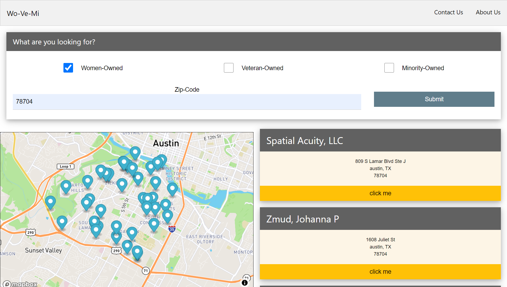

# 💃🏽 Wo - 🎖 Ve - 🤝🏽 Mi

## A search engine highlighting Women, Veteran and Minority-Owned businesses

## Built With:

- HTML
- JavaScript
- CSS

### and the following libraries:

- Jquery
- Mapbox GL JS
- w3.CSS

## Deployed Project:

[Link to deployed project!](https://jenniferfadare.github.io/project_1/)

## How it looks:

## Team Formul8rs

### [Garrett Cox](https://github.com/gacx89)

### [Jennifer Fadare](https://github.com/JenniferFadare)

### [Lafon Clark](https://github.com/blackutcoffee)

### [Obinna Ezekwe](https://github.com/oezekwe)

### [Christian Krantz](https://github.com/ChristianKrantz11)

### [Casey Deriso](https://github.com/CaseyDeriso)

## Milestones:

### Casey:

## I struggled through learning a new CSS framework, but it was worth it.

## After learning the framework, I had fun manipulating elements to stack neatly on different screen sizes.

### Garrett:

## Dealing with multiple fetch requests and accounting for the time it takes them to complete was a challenge.

## I learned about the strange things that can happen when you mix asynchronous and synchronous functions and how to work around them.
